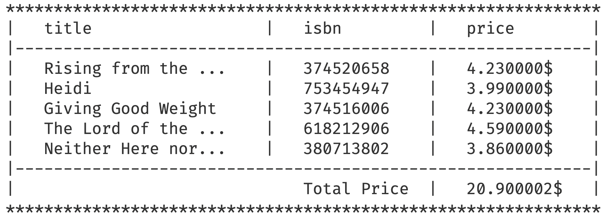
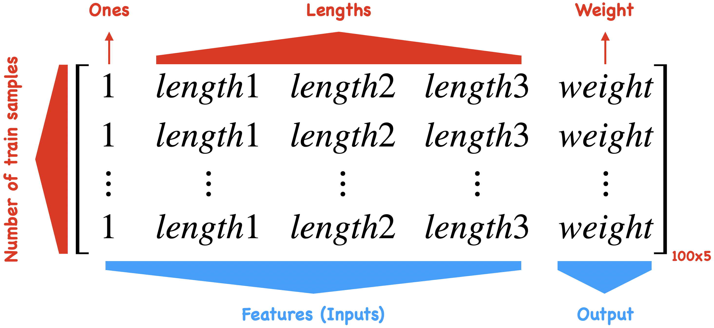
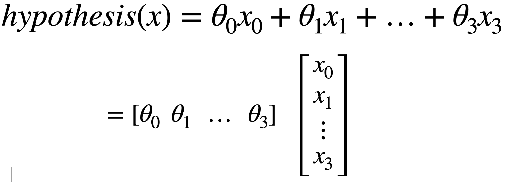
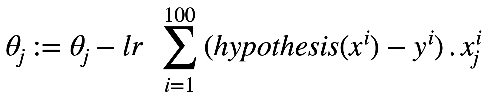
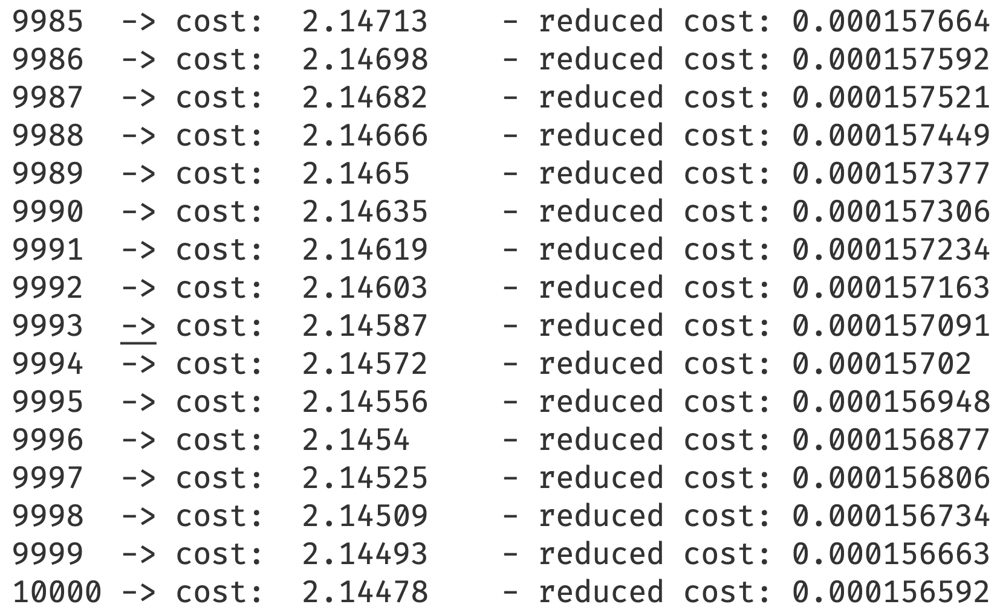

# Advanced Programming Course - HW1
<p  align="center"> <b>Homework 1 - Fall 2022 Semester <br> Deadline: Shanbe 30 Mehr - 11:59 pm</b> </p>

</br>

## Outline

In this homework we are going to answer 3 separate questions: in the first question we will write a bash script and in the other 2 we deal with c++ questions. 


</br>

## Question 1 - Bash Script
We want to write a bash script to rename all the files in a specific folder and add the *today date* to their name like the following example:

```cpp
file1.txt     ->    2022-10-09_file1.txt
file2.txt     ->    2022-10-09_file2.txt
file3.txt     ->    2022-10-09_file3.txt
file4.txt     ->    2022-10-09_file4.txt
file5.csv     ->    2022-10-09_file5.csv
file6.csv     ->    2022-10-09_file6.csv
file7.pdf     ->    2022-10-09_file7.pdf
file8.api     ->    2022-10-09_file8.api
file9.plist   ->    2022-10-09_file9.plist
```
But your script should not affect the name of directories(folders) in the path.

To do this go to the `bash` directory and write your script in `renamer.sh` file. Your script should be able to get 2 inputs from the command line:
- the first one is a required input containing the path to the desired directory
- the second one is an optional flag (*-c* or *--copy*) telling the script to make a copy of the original files with the new filenames (original files' names should not be changed).

So your script should be run in all the following circumstances:

```sh
./renamer.sh /path/to/directory        #rename all the files in the path
./renamer.sh /path/to/directory -c     #make copies and rename them
./renamer.sh /path/to/directory --copy #exactly like -c flag
```
Your script should also make some outputs stating what it is doing, the output should be like this:

```sh
directory submitted successfully!
name: file1.txt  type: .txt   -> changing name to: 2022-10-09_file1.txt
name: file2.txt  type: .txt   -> changing name to: 2022-10-09_file2.txt
name: file3.txt  type: .txt   -> changing name to: 2022-10-09_file3.txt
name: file4.txt  type: .txt   -> changing name to: 2022-10-09_file4.txt
name: file5.csv  type: .csv   -> changing name to: 2022-10-09_file5.csv
name: file6.csv  type: .csv   -> changing name to: 2022-10-09_file6.csv
name: file7.pdf  type: .pdf   -> changing name to: 2022-10-09_file7.pdf
name: file8.api  type: .api   -> changing name to: 2022-10-09_file8.api
name: file9.plist type: .plist -> changing name to: 2022-10-09_file9.plist
```

or in case of making copies:

```sh
directory submitted successfully!
name: file1.txt  type: .txt   -> making copy: 2022-10-09_file1.txt
name: file2.txt  type: .txt   -> making copy: 2022-10-09_file2.txt
name: file3.txt  type: .txt   -> making copy: 2022-10-09_file3.txt
name: file4.txt  type: .txt   -> making copy: 2022-10-09_file4.txt
name: file5.csv  type: .csv   -> making copy: 2022-10-09_file5.csv
name: file6.csv  type: .csv   -> making copy: 2022-10-09_file6.csv
name: file7.pdf  type: .pdf   -> making copy: 2022-10-09_file7.pdf
name: file8.api  type: .api   -> making copy: 2022-10-09_file8.api
name: file9.plist type: .plist -> making copy: 2022-10-09_file9.plist
```
You can use the `bash/files` directory for your tests but remember your script should work for any other directories as well.
Your script should also detect if the given path is valid or not.

***Question*** in most of the scripts you will see a `#!/bin/bash` or something similar in the first line, what does these lines mean exactly?

***Question*** How can you run the `renamer.sh` script from any folder on your computer without providing its path?

</br>
</br>

## Question 2 - Book Management System
In this Question, we want to write a simple book management program to help a bookstore to manage its inventory. Put all your codes for this question in `book_inventory.cpp/h` files. To do this you need to implement 4 functions that will be explained in the following sections but before that let's create the following struct to enable us to store the information of our books.

```cpp
struct Book
{
  std::string title;          // title of the book
  std::string author;         // author of the book
  float cost;                 // cost of the book
  std::string isbn;           // a unique string assigned to each book
  std::string language_code;  // language of the book
  int num_pages;              // number of pages
  std::string publisher;      // publisher of the book
  int count;                  // how many books left in the inventory
};
```

Also, since we work with more than one book we will be using `std::vector<Book>` a lot. So to avoid repeating, let's put the following line to ease our pain.

```cpp
using Books = std::vector<Book>;
```
Now, let's go ahead and explain the needed functions, but ***remember*** you are not allowed to change the functions or define new ones, but you may (and probably should) add some keywords or characters to them.
***note*** put all your functions in a namespace called `book`.

  - **read_database** <br/>
  There is a `resource/inventory.txt` file that contains all the books we currently have, In this function, you need to read this file and store its contents in a `Books` object.
    ```cpp
    Books read_database(std::string filepath)
    ```
    Every line in `resource/inventory.txt` file represents a book and its information: *row number*, *title*, *author*, *cost*, *isbn*, *language*, *publisher*, and *count* respectively.

    ***note*** if the *filepath* is not valid, you need to throw a runtime error.

    ***Question*** what is the purpose of *line 21* in `CMakeLists.txt` and what does it do?

  <br/>

  - **search** <br/>
  In this function you need to find the *isbn* code of a book from its *title*. return *"none"* if the title doesn't exist.
    ```cpp
    std::string search(Books inventory, std::string title)
    ```

  <br/>

  - **order** <br/>
  In this function, you can order a book using its *isbn* number and add it to the shopping list provided in the input. remember to change the count of the book in the inventory after the order. return `true` if the order is successful and `false` otherwise.
    ```cpp
    bool order(Books inventory, Books shopinglist, std::string isbn)
    ```

  <br/>

  - **get_receipt** <br/>
  Print out a beautiful receipt for the customer using his/her shopping list and return the total price of the books. 
    ```cpp
    double get_receipt(Books shopinglist)
    ```
    your printed receipt should be something like this (or more beautiful for extra points):

    <br>
    <p align="center">
    
    </p>
    <br>

</br>
</br>

## Question 3 - Linear Regression
In this question, we want to predict the weight of some kind of fish from the fish's lengths and diameters. 
Open the `resources/fish.txt` file. each line contains information about one fish: the first 3 numbers of each row are the lengths of different parts of the fish's body and the 4th number is the weight. we want to regress a line from the lengths to the weight to predict the weight.

We will regard these lengths as the *features* or *inputs* and their weight as the *output*

Now, to regress our line, we need to implement 5 functions that will be explained below. But before that let's define the following line to store the data more easily in a 2D matrix.
```cpp
using Data = std::vector<std::vector<double>>;
```

***remember*** as before you are not allowed to change the functions or define new ones, but you may (and probably should) add some keywords or characters to them.
***note*** put all your functions in a namespace called `regression`.


  - **read_database** <br/>
  Read the `resources/fish.txt` and store all the data in a 2D matrix.
    ```cpp
    Data read_database(std::string filepath)
    ```
    The result would be a *100x4* matrix with each row representing a single fish, the first 3 columns are lengths and the 4th column is the weight. most of the time in regression we need a bias to get the best result so we need to add a column at the beginning of the matrix containing only ones. So, at the end you should create a *100x5* matrix from the *txt* file like the following picture:

    <br>
    <p align="center">
    
    </p>
    <br>

  <br/>

- **hypothesis** <br/>
  hypothesis is a function that we guess and eventually train in order to make good predictions.
    ```cpp
    double hypothesis(std::vector<double> theta, std::vector<double> x)
    ```
    In linear regression the hypothesis is a linear combination of our inputs:

    <br>
    <p align="center">
    
    </p>
    <br>

    The *thetas* are coefficients that we try to find by training and the *x* vector is one single input (a one + three lengths).

  <br/>

- **cost_function** <br/>
  cost function is the distance of our hypothesis output from the actual output for all the training set.
    ```cpp
    double cost_function(Data dataset, std::vector<double> theta)
    ```
    we calculate this distance using square error:

    <br>
    <p align="center">
    
    </p>
    <br>

    where x<sup>i</sup> and y<sup>i</sup> are the i<sup>th</sup> input and output from the dataset:
    - x<sup>i</sup>: first 4 columns of the i<sup>th</sup> row in dataset
    - y<sup>i</sup>: fifth column of the i<sup>th</sup> row in dataset

  <br/>

- **update** <br/>
  with this function we will update our hypothesis (theta) using the database in order to have better predictions. The function returns the updated *theta*.
    ```cpp
    std::vector<double> update(Data dataset, std::vector<double> theta, double lr)
    ```
    The update rule is as follows:

    <br>
    <p align="center">
    
    </p>
    <br>

    - *lr* is the learning rate.
    - theta<sub>j</sub> is the j<sup>th</sup> index of vector theta
    - x<sub>j</sub><sup>i</sup> is the j<sup>th</sup> index of x<sup>i</sup>

  <br/>

- **linear_regression** <br/>
  Finally we need to call the *update* function multiple times until we get good theta coefficients.
    ```cpp
    std::vector<double> linear_regression(Data dataset, std::vector<double> init_theta, double lr)
    ```
    call the *update* function exactly 10000 times and print out the progress of your work.

    <br/>
    <p align="center">
    
    </p>
    <br/>


***challenge*** In c++ questions (questions 2 and 3) you should decide the optimum approach to pass the arguments to each function (i.e. pass by reference, pass by value, using *const*, and ...)

<br>
<br>

# Finally
As mentioned before, keep all your implementations in `renamer.sh`, `book_inventory.cpp/h`, and `regression.cpp/h`. do not alter other files at all. In case you want to test your code you may only use the `debug` section of the `main.cpp` which will be explained in the TA class.

<br/>

```cpp
if (true) // make false to run unit tests  
{ 
	// debug section 
}  
else  
{  
	::testing::InitGoogleTest(&argc, argv);  
	std::cout << "RUNNING TESTS ..." << std::endl;  
	int ret{RUN_ALL_TESTS()};  
	if (!ret)  
		std::cout << "<<<SUCCESS>>>" << std::endl;  
	else  
	  std::cout << "FAILED" << std::endl;  
}  
return 0;
```
<br/>
<p  align="center"> <b>GOOD LUCK</b> </p>


<br/>
<p align="center">

</p>
<br/>